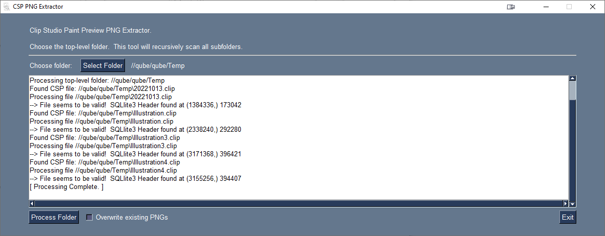

# Clip Studio Paint Preview PNG Extractor



This tool will let you choose a folder, from which it will recursively search for all .clip and .csp files, and extract the PNG preview image from them to the same name.png in the same folder.

You can download the current release here:  https://github.com/DranoTheCat/ClipStudioPaintPreviewExtractor/releases/tag/v0.0.1

The distribution binary was compiled via:
```
pyinstaller --onefile --windowed csp_preview_extractor.py 
```
